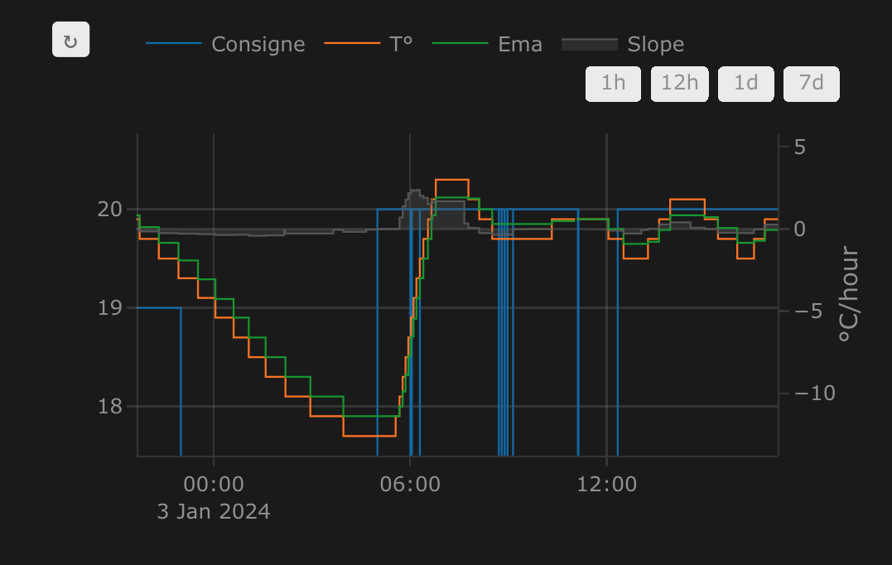

# Einige wichtige Add-ons

- [Einige wichtige Add-ons](#einige-wichtige-add-ons)
  - [Die Versatile Thermostat UI Card](#die-versatile-thermostat-ui-card)
  - [Die Scheduler-Komponente!](#die-scheduler-komponente)
  - [Regelungskurven mit Plotly zur Feinabstimmung Ihres Thermostats](#regelungskurven-mit-plotly-zur-feinabstimmung-ihres-thermostats)
  - [Ereignisbenachrichtigung mit dem AppDaemon NOTIFIER](#ereignisbenachrichtigung-mit-dem-appdaemon-notifier)

## Die Versatile Thermostat UI Card
Es wurde eine spezielle Karte für den Versatile Thermostat entwickelt (basierend auf Better Thermostat). Sie ist hier verfügbar: [Versatile Thermostat UI Card](https://github.com/jmcollin78/versatile-thermostat-ui-card) und bietet eine moderne Ansicht aller VTherm-Status:


## Die Scheduler Komponente!

Um das Potenzial des Versatile Thermostatvoll auszuschöpfen, empfehle ich, ihn zusammen mit der [Scheduler Komponente](https://github.com/nielsfaber/scheduler-component) zu verwenden. Die Scheduler-Komponente ermöglicht die Klimasteuerung auf Basis vordefinierter Modi. Während diese Funktion bei einem herkömmlichen Thermostat nur eingeschränkt verfügbar ist, entfaltet sie in Kombination mit dem vielseitigen Thermostat ihr volles Potenzial.

Angenommen, Sie haben sowohl den Versatile Thermostat als auch die Scheduler-Komponente installiert, hier ist ein Beispiel:

Fügen Sie im Scheduler einen Zeitplan hinzu:


Wählen Sie die Gruppe "Klima", wählen Sie eine (oder mehrere) Entität(en) aus, wählen Sie "MAKE SCHEME" und klicken Sie auf "Weiter":
(Sie können auch "SET PRESET" wählen, aber ich bevorzuge "MAKE SCHEME".)


Definieren Sie Ihr Modusschema und speichern Sie es:


In diesem Beispiel habe ich den ECO-Modus für die Nacht und für den Tag, wenn niemand zu Hause ist, den BOOST-Modus für den Morgen und den COMFORT-Modus für den Abend eingestellt.

Ich hoffe, dieses Beispiel hilft weiter. Über Feedback freuen wir uns!

## Regelungskurven mit Plotly zur Feinabstimmung Ihres Thermostats
Sie können eine Kurve ähnlich der in [einigen Ergebnissen](#some-results) gezeigten erhalten, indem Sie eine Plotly-Diagrammkonfiguration verwenden und die [hier](#custom-attributes) beschriebenen benutzerdefinierten Attribute des Thermostats nutzen:

Ersetzen Sie die Werte zwischen `[[ ]]` durch Ihre eigenen.
<details>

```yaml
- type: custom:plotly-graph
  entities:
    - entity: '[[climate]]'
      attribute: temperature
      yaxis: y1
      name: Consigne
    - entity: '[[climate]]'
      attribute: current_temperature
      yaxis: y1
      name: T°
    - entity: '[[climate]]'
      attribute: ema_temp
      yaxis: y1
      name: Ema
    - entity: '[[climate]]'
      attribute: on_percent
      yaxis: y2
      name: Power percent
      fill: tozeroy
      fillcolor: rgba(200, 10, 10, 0.3)
      line:
        color: rgba(200, 10, 10, 0.9)
    - entity: '[[slope]]'
      name: Slope
      fill: tozeroy
      yaxis: y9
      fillcolor: rgba(100, 100, 100, 0.3)
      line:
        color: rgba(100, 100, 100, 0.9)
  hours_to_show: 4
  refresh_interval: 10
  height: 800
  config:
    scrollZoom: true
  layout:
    margin:
      r: 50
    legend:
      x: 0
      'y': 1.2
      groupclick: togglegroup
      title:
        side: top right
    yaxis:
      visible: true
      position: 0
    yaxis2:
      visible: true
      position: 0
      fixedrange: true
      range:
        - 0
        - 1
    yaxis9:
      visible: true
      fixedrange: false
      range:
        - -2
        - 2
      position: 1
    xaxis:
      rangeselector:
        'y': 1.1
        x: 0.7
        buttons:
          - count: 1
            step: hour
          - count: 12
            step: hour
          - count: 1
            step: day
          - count: 7
            step: day
```
</details>

Beispiel für mit Plotly erstellte Kurven:



## Ereignisbenachrichtigung mit dem AppDaemon NOTIFIER
Diese Automatisierung nutzt die hervorragende AppDaemon-App namens NOTIFIER, die von Horizon Domotique entwickelt wurde und [hier](https://www.youtube.com/watch?v=chJylIK0ASo&ab_channel=HorizonDomotique) vorgestellt wird. und der Code ist [hier](https://github.com/jlpouffier/home-assistant-config/blob/master/appdaemon/apps/notifier.py) verfügbar. Damit können Benutzer über sicherheitsrelevante Ereignisse benachrichtigt werden, die an einem beliebigen Versatile Thermostat auftreten.

Dies ist ein hervorragendes Beispiel für die Verwendung der hier beschriebenen Benachrichtigungen: [Benachrichtigung](#notifications).
<details>

```yaml
alias: Überwachung Sicherheitsmodus Heizung
description: Sendet eine Benachrichtigung, wenn ein Thermostat in den Sicherheits- oder Power-Modus wechselt.
trigger:
  - platform: event
    event_type: versatile_thermostat_security_event
    id: versatile_thermostat_security_event
  - platform: event
    event_type: versatile_thermostat_power_event
    id: versatile_thermostat_power_event
  - platform: event
    event_type: versatile_thermostat_temperature_event
    id: versatile_thermostat_temperature_event
condition: []
action:
  - choose:
      - conditions:
          - condition: trigger
            id: versatile_thermostat_security_event
        sequence:
          - event: NOTIFIER
            event_data:
              action: send_to_jmc
              title: >-
                Heizkörper {{ trigger.event.data.name }} - {{
                trigger.event.data.type }} Sécurité
              message: >-
                Der Heizkörper {{ trigger.event.data.name }} wurde in den Sicherheitsmodus {{
                trigger.event.data.type }} versetzt, da das Thermometer nicht mehr reagiert
                .\n{{ trigger.event.data }}
              callback:
                - title: Heizungsventil
                  event: heizungsventil
              image_url: /media/local/alerte-securite.jpg
              click_url: /lovelace-chauffage/4
              icon: mdi:radiator-off
              tag: Heizkörper_Sicherheitsalarm
              persistent: true
      - conditions:
          - condition: trigger
            id: versatile_thermostat_power_event
        sequence:
          - event: NOTIFIER
            event_data:
              action: send_to_jmc
              title: >-
                Heizkörper {{ trigger.event.data.name }} - {{
                trigger.event.data.type }} Délestage
              message: >-
                Der Heizkörper {{ trigger.event.data.name }} wurde auf {{
                trigger.event.data.type }} Lastabwurf umgeschaltet, da die maximale Leistung
                überschritten wurde.\n{{ trigger.event.data }}
              callback:
                - title: Heizungsventil
                  event: heizungsventil
              image_url: /media/local/alerte-delestage.jpg
              click_url: /lovelace-chauffage/4
              icon: mdi:radiator-off
              tag: Heizkörper_Stromausfall_Alarm
              persistent: true
      - conditions:
          - condition: trigger
            id: versatile_thermostat_temperature_event
        sequence:
          - event: NOTIFIER
            event_data:
              action: send_to_jmc
              title: >-
                Das Thermometer des Heizkörpers {{ trigger.event.data.name }} reagiert nicht mehr
.
              message: >-
                Das Thermometer des Heizkörpers {{ trigger.event.data.name }}
                reagiert schon seit längerer Zeit nicht mehr.\n{{ trigger.event.data }}
              image_url: /media/local/thermometre-alerte.jpg
              click_url: /lovelace-chauffage/4
              icon: mdi:radiator-disabled
              tag: Heizkörper-Thermometer-Alarm
              persistent: true
mode: queued
max: 30
```
</details>